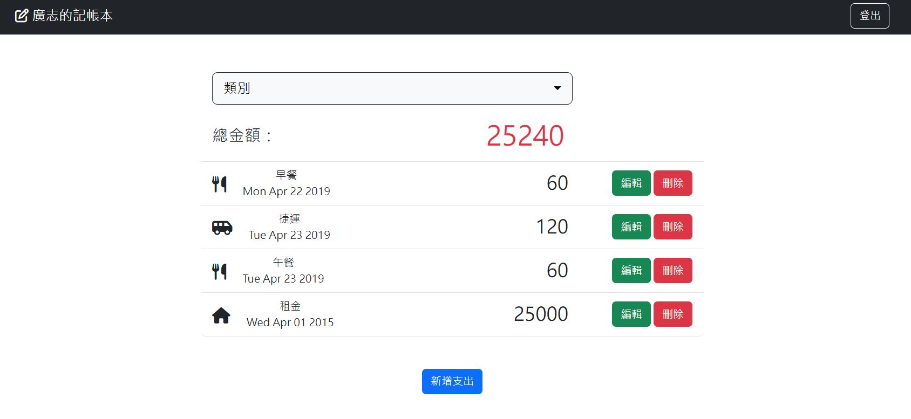

## Restaurant List



### 功能
+ 查看所有支出紀錄
+ 新增支出紀錄
+ 編輯支出紀錄
+ 刪除支出紀錄
+ 可以特定分類篩選支出紀錄
+ 使用者可以自行註冊帳號密碼或使用Facebook帳號登入

### 開始使用
1. 請先確認有安裝Node.js及npm
2. Clone本專案至您的電腦：開啟終端機，進入欲存放本專案的資料夾路徑，輸入以下指令

```bash
git clone https://github.com/realyutou/expense-tracker.git
```

3. 進入本專案資料夾，安裝相關套件：輸入以下指令

```bash
npm install
```

4. 安裝完畢後，設定環境變數連線，詳見.env.example

5. 產生種子資料

```bash
npm run seed
```

6. 執行此專案：輸入以下指令

```bash
npm run start
```

7. 若終端機出現以下訊息，代表專案已順利執行，請至瀏覽器進入該網址

```bash
The server is running on http://localhost:3000
```

8. 若欲暫停使用

```bash
ctrl + c
```

### 開發工具
  + Node.js 18.16.0
  + Bootstrap 5.3.0
  + Font-awesome 6.4.0